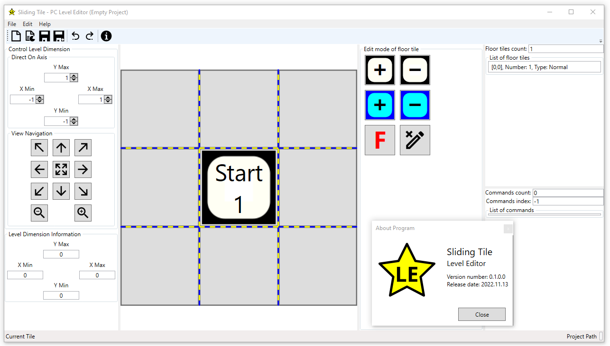
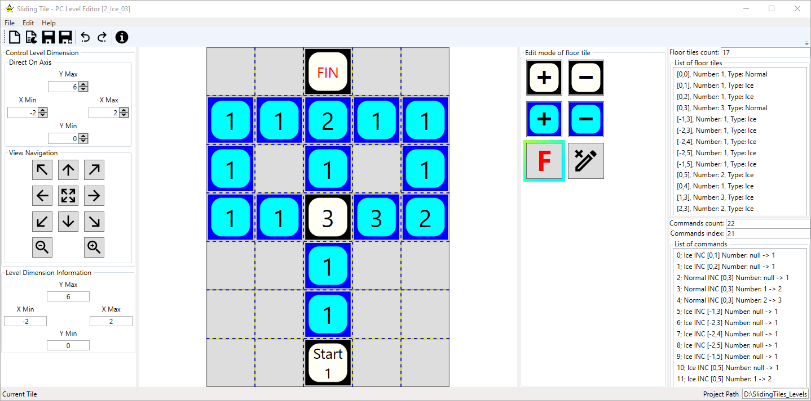

# Sliding Tile - PC Level Editor
 
User-friendly tool for preparing levels for the MonoGame: Sliding Tile. The source code of this game you can find here: https://github.com/bertekg/SlidingTile_MonoGame.

## Builds
If you want you can download current and previous versions of builds here: https://drive.google.com/drive/folders/1O5L3vzrydFZ0jHwOJMal0YTFBWt2qBsw?usp=share_link

## Screenshots
All screenshots from current and previous versions are available here: https://drive.google.com/drive/folders/1-FidD1OD7rUD8FofAtj2pLFxnxY2X5eZ?usp=sharing

### 1. Inital program view and 'About Program' window

### 2. Sample save level

